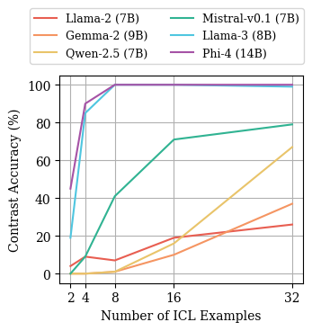

## Function Induction and Task Generalization
Code for paper "Function Induction and Task Generalization: An Interpretability Study with Off-by-One Addition". [[Paper]](https://arxiv.org/abs/2507.09875)

<p align="center">
    
    <br>
</p>


### Getting Started

```bash
conda create -n fi python=3.12
conda activate fi
pip install torch==2.6.0 torchvision==0.21.0 torchaudio==2.6.0 --index-url https://download.pytorch.org/whl/cu126
pip install transformer_lens==2.16.0 transformers==4.51.3
pip install git+https://github.com/callummcdougall/CircuitsVis.git#subdirectory=python
pip install matplotlib plotly
pip install --upgrade nbformat

# to access data_utils.py and patching_utils.py in subdirectories
export PYTHONPATH="$PWD:$PYTHONPATH"
```

### Paper Summary

"Off-by-one addition" is the counterfactual task of adding an additional one to the sum of two numbers, e.g., completing the sequence "1+1=3, 2+2=5, 3+3=" with "7".

#### 1. Language models can learn off-by-one addition with in-context learning.

<p align="center">
    
    <br>
</p>

* We evaluated six recent language models and they all have non-trivial to near-perfect performance on this task.
* See `1_off_by_one_addition_eval/eval.py` for our code to evaluate models on off-by-one addition. `results_aggregated.csv` contains all evaluation results.

#### 2. We identified a function induction mechanism responsible for this.

<p align="center">
    <br>
    
    <br>
</p>

* We use mechanistic interpretability technique to understand how models manage to do this. We identified three groups of attention heads, connected in a way similar to the induction head mechanism.
* See `2_circuit_discovery/gemma_2_9b.ipynb` for a demo of circuit discovery and result visualization using Gemma-2 (9B).

#### 3. Function induction heads work in parallel and each emits a fraction of the +1 function.

<p align="center">
    
    <br>
</p>

* We study the effect of FI heads output by patching their outputs to naive prompts (e.g., "2=2, 3=?").
* See `3_circuit_eval_and_analysis/function_vector.ipynb` for a demo of function vector style analysis.

#### 4. Function induction heads enable broader task generalization.

<p align="center">
    
    <br>
</p>

* We design four task pairs, (a) Off-by-k addition, (b) Shifted MMLU, (c) Caesar Cipher, (d) Base-k addition.
* When ablating the identified function induction heads, models struggle to perform the second step in these two step tasks.
* See `4_task_generalization` for code to reproduce the results.

